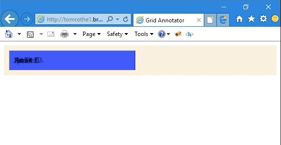

# CSS Grid Annotator

Automatically annotate CSS Grid items, so they are correctly positioned in IE11.

The script only checks IE11.
It looks through all elements on the page and checks if the `display` property equals `-ms-grid`.
If so it will annotate each visible child with explicit `-ms-grid-column` / `-ms-grid-row`.

Please check back under the releases tab for recent releases.

## Gotchas

- The script does checks only for the prefixed grid property `-ms-grid`.
- The script currently only supports `grid-template-columns` (no template rows yet).
- If there are more items/children than specified in the template columns, new rows will be created.

## TODO

- Make sure it also works when we add new elements via Javascript.
